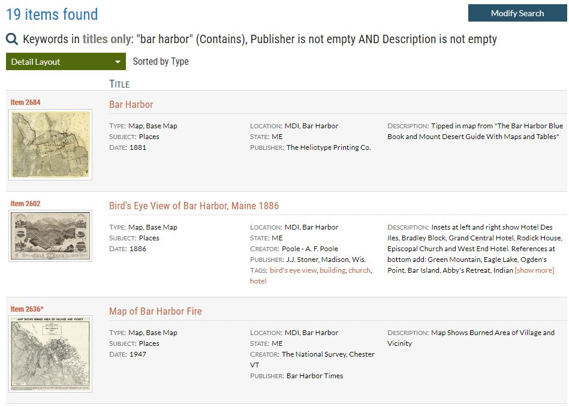
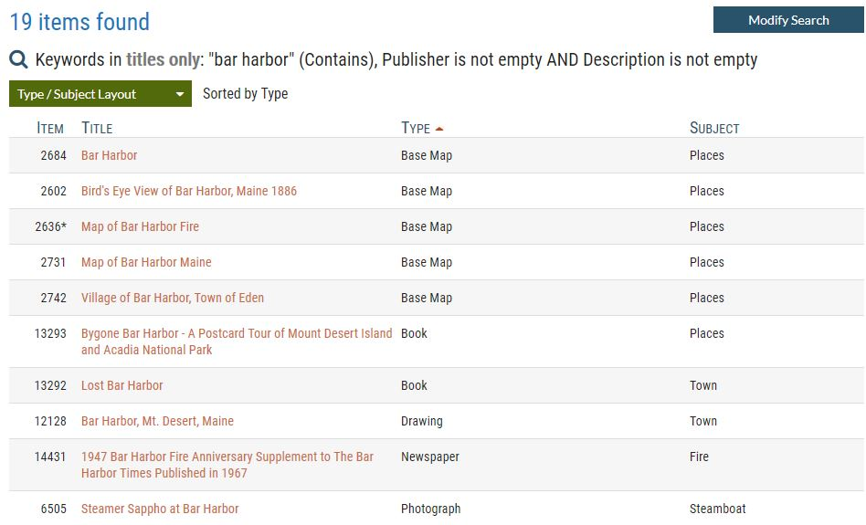
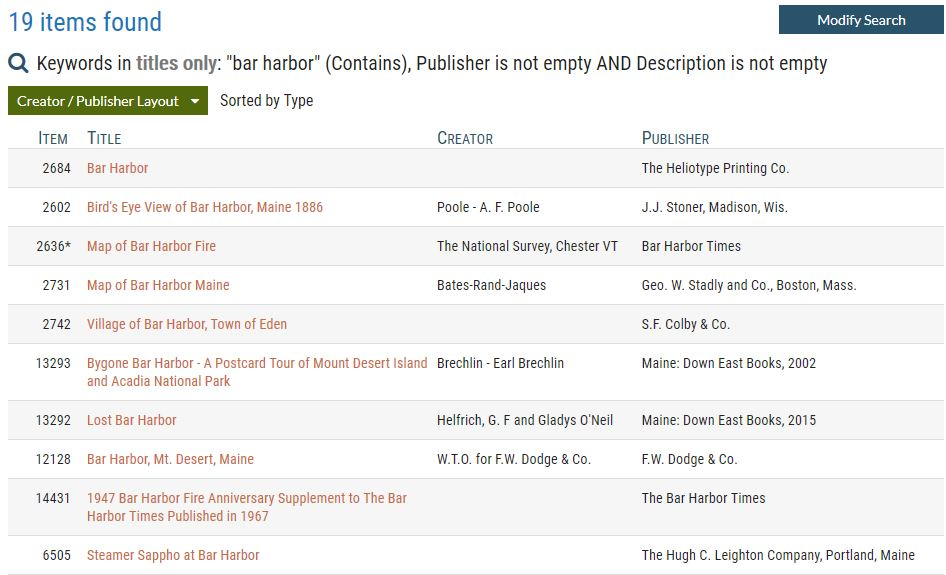
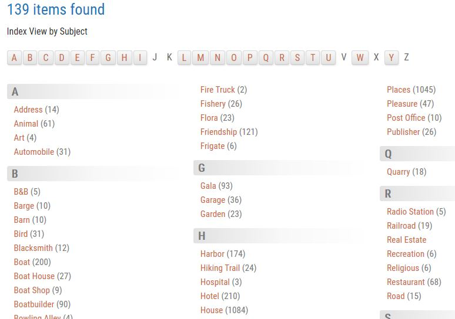
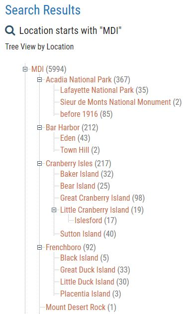
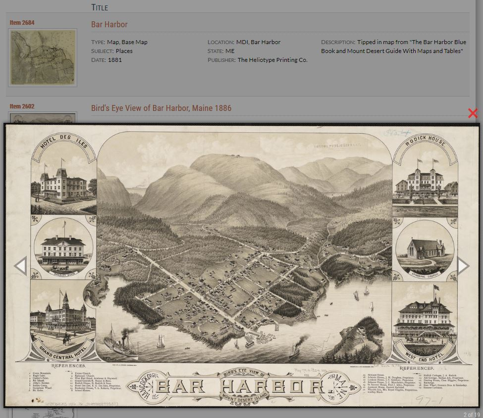
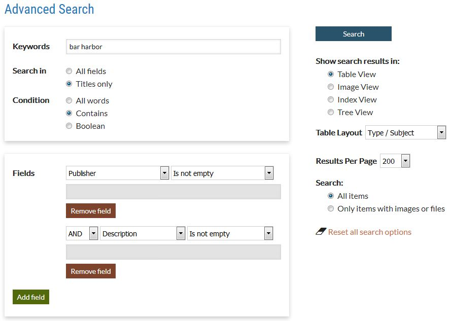

# AvantSearch

#################################################

> **This plugin is under development. Please wait for Release 2.0.**

#################################################

Provides extended searching and search results capabilities for an Omeka Classic installation.

## Table of Contents

- [Dependencies](https://github.com/gsoules/AvantSearch#dependencies)
- [Installation](https://github.com/gsoules/AvantSearch#installation)
- [Differences from Omeka's Native Search](https://github.com/gsoules/AvantSearch#differences-from-omekas-native-search)
- [Search Results Views](https://github.com/gsoules/AvantSearch#search-results-views)
    - [Table View](https://github.com/gsoules/AvantSearch#table-view)
        - [Table View Detail Layout](https://github.com/gsoules/AvantSearch#table-view-detail-layout)
        - [Table View Custom Layouts](https://github.com/gsoules/AvantSearch#table-view-custom-layouts)
    - [Image View](https://github.com/gsoules/AvantSearch#image-view)
    - [Tree View](https://github.com/gsoules/AvantSearch#tree-view)
    - [Index View](https://github.com/gsoules/AvantSearch#index-view)
- [Lightbox](https://github.com/gsoules/AvantSearch#lightbox)
- [Usage](https://github.com/gsoules/AvantSearch#usage)
    - [Advanced Search Page](https://github.com/gsoules/AvantSearch#advanced-search-page)
        - [Date Range Feature](https://github.com/gsoules/AvantSearch#date-range-feature)
    - [Configuration Options](https://github.com/gsoules/AvantSearch#configuration-options)
        - [Ttles Only Option](https://github.com/gsoules/AvantSearch#titles-only-option)
        - [Private Elements Option](https://github.com/gsoules/AvantSearch#private-elements-option)
        - [Columns Option](https://github.com/gsoules/AvantSearch#columns-option)
        - [Layout Selector Width Option](https://github.com/gsoules/AvantSearch#layout-selector-width-option)
        - [Layouts Option](https://github.com/gsoules/AvantSearch#layouts-option)
        - [Detail Columns Option](https://github.com/gsoules/AvantSearch#detail-columns-option)
        - [Index View Option](https://github.com/gsoules/AvantSearch#index-view-option)
        - [Tree View Option](https://github.com/gsoules/AvantSearch#tree-view-option)
        - [Integer Sorting Option](https://github.com/gsoules/AvantSearch#integer-sorting-option)
        - [Address Sorting Option](https://github.com/gsoules/AvantSearch#address-sorting-option)
        - [Relationships View Option](https://github.com/gsoules/AvantSearch#relationships-view-option)
- [Improving Search Results](https://github.com/gsoules/AvantSearch#improving-search-results)
- [Warning](https://github.com/gsoules/AvantSearch#warning)
- [License](https://github.com/gsoules/AvantSearch#license)
- [Copyright](https://github.com/gsoules/AvantSearch#copyright)
- [Credits](https://github.com/gsoules/AvantSearch#credits)
        

## Dependencies
The AvantSearch plugin requires that the [AvantCommon](https://github.com/gsoules/AvantCommon) plugin be installed and activated.

## Installation

To install the AvantSearch plugin, follow these steps:

1. First install and activate the [AvantCommon](https://github.com/gsoules/AvantCommon) plugin.
1. Unzip the AvantSearch-master file into your Omeka installation's plugin directory.
1. Rename the folder to AvantSearch.
1. Activate the plugin from the Admin → Settings → Plugins page.
1. Configure the AvantCommon plugin to specify your item identifier and title elements.
1. Configure the AvantSearch plugin as described in the [Configuration Options](https://github.com/gsoules/AvantSearch#configuration-options) section below.

When this plugin is activated, it dynamically overrides the native Omeka search box (located in the page
header) with the version used by AvantSearch. When you deactivate the plugin, the Omeka search box returns.

## Differences from Omeka's Native Search

AvantSearch completely overrides Omeka's public search features. It provides its own
[Advanced Search](https://github.com/gsoules/AvantSearch#tadvanced-search-page) page
and presents search results in a wide variety of ways. It does not affect Omeka's admin search.
The table below highlights the differences between AvantSearch and Omeka's native search.

Feature | AvantSearch | Omeka Search
--------|------------ | ------------
[Quick search](https://github.com/gsoules/AvantSearch#quick-search) |  **Yes** - Feature | No
[Simple search for All Words](https://github.com/gsoules/AvantSearch#simple-search) |  **Yes** - Feature | No
[Search in Titles only](https://github.com/gsoules/AvantSearch#titles-only-option) | **Yes** - Advanced Search page option | No
[Search only items with images or files](https://github.com/gsoules/AvantSearch#advanced-search-page) | **Yes** - Advanced Search page option | No
[Date range search](https://github.com/gsoules/AvantSearch#advanced-search-page) | **Yes** - Advanced Search page option | No
[User can specify number of results](https://github.com/gsoules/AvantSearch#advanced-search-page) | **Yes** - Advanced Search page option | No
[Tabular results](https://github.com/gsoules/AvantSearch#table-view) | **Yes** - Feature | No
[Custom Results Layouts](https://github.com/gsoules/AvantSearch#table-view-custom-layouts) | **Yes** - Congfiguration option | No
[Image View](https://github.com/gsoules/AvantSearch#image-view) | **Yes** - Feature | No
[Index View](https://github.com/gsoules/AvantSearch#index-view) | **Yes** - Congfiguration option| No
[Tree View (Hierarchical Data)](https://github.com/gsoules/AvantSearch#tree-view) | **Yes** - Congfiguration option | No
[Relationships View](https://github.com/gsoules/AvantSearch#relationships-view-option) | **Yes** - Congfiguration option | No
[Private Elements](https://github.com/gsoules/AvantSearch#private-elements-option) | **Yes** - Congfiguration option | No
[Integer sorting](https://github.com/gsoules/AvantSearch#integer-sorting-option) | **Yes** - Congfiguration option | No
[Address sorting](https://github.com/gsoules/AvantSearch#address-sorting-option) | **Yes** - Congfiguration option | No
[Lightbox](https://github.com/gsoules/AvantSearch#lightbox) | **Yes** - Feature | No
Search by File, Collection, Featured | No | Yes

### Quick Search
Quick Search is a feature of Simple Search that allows you to immediately go to the page for an item by typing the
item's Identifier value in the simple search box. This is much faster than getting back search results for every item
that contains that value and then having to locate and click on the item of interest.

### Simple Search
The AvantSearch version of simple search improves on the native Omeka simple search by only returning results that
contain *all* of the matching keywords instead of any of the keywords. Items that contain some, but not all of the
keywords will not appear in the results. Searching for all keywords tends to provide much more relevant results.
If you need to search for any of the keywords, you can enter the keywords
on the Advanced Search page and choose the Boolean condition.

## Search Results Views
One of the most powerful features of AvantSearch is its ability to display search results in many different ways
which you can customize to meet your needs. In addition to the Index View and Tree View presentations described later,
the Table View lets you specify any number of different layouts to display results in rows and sortable columns.
The screen shots that follow show the same AvantSearch results in three different Table View layouts.

### Table View

#### Table View Detail Layout
The Detail Layout provides a compact presentation of key information about an item including a thumbnail image.
You specify which elements appear in the two columns to the right of the thumbnail. The item's description
automatically appears in the third column. The screen shot below is truncated after the first three results.



<hr/>

#### Table View Custom Layouts
This is an example of a custom layout showing the item's Type and Subject elements. The red triangle next to 'Type'
in the header indicates that the results are sorted ascending by Type. The screen shot below is truncated after the first 10 results.



<hr/>

This is another example of a custom layout, but this one shows the item's Creator and Publisher elements.
Note the asterisk on item 2636. When you are logged in as an administrator, the astersisk indicates that the item
is not public. When not logged in, the item does not appear in the results. You can also define layouts that can
only be chosen when logged in. These layout can be used to show data that is normally hidden from public users.
The screen shot below is truncated after the first 10 results.



### Image View
Image View displays search results as a grid of thumbnails. It's a more compact way to view results when the image is
most important for identifying items of interest. The screen shot below is truncated after the first 10 results.


### Index View
Index View displays information like the index in a book. It consolidates values into unique groups having the same
value. The screen shot below is truncated midway through the B's.

When the index field contains hierarchical data, Index View shows only the leaf (lowest level) values in the
hierarchhy. For non-hierarchical data, Index View shows the entire value. The data is considered to be
hierarchical if the index field element is also configured for use as a Tree View field.



### Tree View

Tree View display hierarchical data in tree format. The screen shot below shows just a fragment of the 
full hierarchy (the places on Mount Desert Island a.k.a. MDI).
                                                                                                   


## Lightbox
Both the Table View Detail Layout and the Image View display thumbnails for an item's image if it has one. If the item
has no image, a placeholder image is displayed. When you click on a thumbnail, the AvantSearch plugin displays a large
version of the image in a popup. You can close the popup by clicking on the red X above its top right corner,
or by clicking anywere outside the popop, or by pressing the ESC key.

You can click on the popup to see the next image, or click on the left or right arrows on either side of the image
to navigate forward or backward through the image. The lightbox will display every thumbnail that appears on the page.

In the screens shot below, the popup appeared when the user clicked on the thumbnail for item 2602
                                                                                                   


## Usage
Once installed, AvantSearch entirely overrides Omeka's native user interface for public search (Omeka's native admin
search is still available from admin pages). There are several configuration options available on the plugin's
configuration page.

### Advanced Search Page
AvantSearch provides its own Advanced Search page. You access this page by either clicking on the Advanced Search
link that appears below the simple search box in the header of every page, or by clicking the Modify Search button
that appears on search result pages.

The screen shot below shows the search conditions that were
specified to generate the Table View Custom Layout - Type / Subject screen shot shown earlier.



#### Date Range Feature
When AvantCommon is configured to provide Start and End years, year start and end text boxes will appear as
filters at the bottom of the Advanced Search page. A user can provide values for both the start and end years to
limit search results to items in that range inclusive. For example if you specify 1900 for the start year and
1940 for end year, search will find items with start year greater than or equal to 1900 and less than or equal to 1940.
If you only provide a value for the start year, the search will find items where the start year is that date
or more recent. If you only provide a value for the end year, the filter will find items where the end year is that
date or older.

### Configuration Options
The sections that follow describe each of the options on the AvantSearch plugin configuration page.

Many options require that you specify a formatted list of information using commas or other characters as separators.
For these options, spaces before and after the separators are ignored.

<hr/>

#### Titles Only Option
When this option is checked, radio buttons will appear under the keywords text box on the Advanced Search page to let the user choose
to search in all fields or in titles only. This feature is very helpful for narrowing search results down
to only the most relevant items because titles often contain the most important keywords.

**NOTE:** If you want to use this option, but the configuration page says it's not available for your installation, you'll need to add a FULLTEXT
index to the `title` column of the `search_text` table. This is easily done using phpMyAdmin by following these steps:
1. Select the 'search_texts' table
1. Click the Structure tab
1. On the row for the `title` column, click Fulltext among the actions at the far right
1. Click OK on the dialog confirming that you want to add FULLTEXT to the column
1. The `title` column will now appear in the Indexes section showing its type as FULLTEXT (expand the Indexes
section if it's not visible)

<hr/>

#### Private Elements Option
This option lets you specify a list of element names, one per row, that:
* Should not be searchable via a keyword search
* Don't appear to public uses in the Fields dropdown on the Advanced Search page (they will appear to a logged in administrator)

For example, you might have elements used to record internal information such as notes and item status that
contain information meant only for administrators. You can specify "Notes" and "Status" in the Private Elements text box to
prevent this information from being searched by the public.

Here are key points regarding private elements:

* Private elements will not appear as field selections on the Advanced Search page unless you are logged
in as an administrator.
* The text of private elements will not be recorded in the search_texts table, and therefore will not be searched when
performing a keyword search. This is true whether or not you are logged in as an administrator.
* To search for text in private elements, an administrator can do a field search in those fields, either through the public
Advanced Search page or using the native Omeka Advanced Search page.
* If you add an existing element to the private elements list, that element's text will still be contained in the
search_texts table and therefore be found via a keyword search. To hide the element's content, you
must reindex your Omeka database to force the search_texts table to be rebuilt without the private element text.
You do this by clicking the Index Records button on the Omeka
[Search Settings](https://omeka.org/classic/docs/Admin/Settings/Search_Settings/) page.
* If you uninstall AvantSearch and want to make private elements searchable again, reindex your Omeka database as
described in the previous bullet.
 
This features solves a problem in Omeka's native search whereby the text of all elements are searched, including
information that is hidden from public users by the [Hide Elements](http://omeka.org/classic/plugins/HideElements/)
plugin. This can produce keyword search results containing items that match the
search criteria, but that don't display the elements that resulted in the hit. For example, the search might
find keywords that appear in an item's hidden Notes element, but in no other public elements for that item. The user
then gets a search result that appears to contain none of the keywords they were looking for.

Below is an example specification of the Private Elements option.

```
Notes
Status
```

<hr/>

#### Columns Option

Use the Columns option specify:
* The order of columns from left to right in search results Table View
* An alias for an elements name e.g. 'Catalog #' for the Identifier element
* The width of a column
* The alignment of column text (left, center, or right)

###### Syntax:

The syntax for each row of the Columns options is

    <element-name> [ "," <alias>] [ ":" <width> [ "," <alignment>] ] ]

Where:

* `<element-name>` is the name of an Omeka element.
* `<alias>` is an optional parameter preceded by a comma to provide another name for element e.g. 'ID' for 'Identifier'.
* `<width>` is an optional parameter preceded by a colon to indicate the width of the element's column in pixels.
* `<alignment>` is an optional parameter preceded by a comma that can only be specified if `width` is provided. It
specifies the alignment of the column's text as `right`, `center`, or `left`.

###### Column Order:

The order of columns from left to right in search results Table View is determined as follows:
* The order, first to last, in which you specify elements with the Columns option.
* For elements that are not specified in the Columns option, the order in which column names appear, top to bottom, and
left to right, in the Detail Layout option.

Note that because of the order precedence above, you cannot have columns appear in a specific order in one layout
and in a different order in another layout. The reason for this restriction is because the content for all columns
is contained in the HTML for the search results Table View; however, only the columns for the selected
layout are visible. When you select another layout, the previous layout's columns are hidden and the new layout's
columns are made visible. This is what allows instantaneous switching between layouts.

Below is an example specification for the Columns option.

```
Identifier, ID: 120, right
Title, 300, center
Type, 250, right
Subject,
Archive Volume, Volume
```

<hr/>

#### Layout Selector Width Option
Use this option to specify an integer indicating the width of the layout selector that appears on Table View search
results. For example, specify 250 to mean 250px. This option saves you from having to code CSS to adjust the
width to a size that is appropriate for your layout options and your theme's styling. Experiment to find a value that
makes the selector just wide enough to accommodate the longest layout you defined in the Layouts option described below.

<hr/>

#### Layouts Option

The Layouts option lets you specify different ways to present search results in Table Vew. The layouts you define
here will appear in the Layout Selector and on the Advanced Search page.

###### Format:
* Specify each layout on a separate row
* On each row specify: *ID*, *Name*, *'admin'* (optional), a colon, comma-separated list of columns
* The *ID* must start with 'L' followed by an integer e.g. 'L3'.  The numbers do not have to be consecutive.
* The ID 'L1' is reserved for the Detail layout described in the next section.
* Specify `admin` after the *Name* to indicate that only a logged in administrator can see and use the layout.

The purpose of the ID is to uniquely identify a layout in the query string for Table View page. You can use this query string as a link
on web pages to display search results in a specific layout. The ID ensures that those results will appear using the correct
layout even if you change the layout's *Name* or its position in the Layouts list.

Below is an example specification of Layouts.

```
L1, Summary
L2, Creator/Publisher: Identifier, Title, Creator, Publisher, Date
L3, Type/Subject: Identifier, Title, Subject, Type
L6, Confidential, admin: Identifier, Title, Status, Notes
```

Notes about the example above:
* Each layout begins with an *ID* and *Name*
* The fourth row also specifies *'admin'*
* You don't specify columns for the L1 Layout (described in the next section), but you do specify its *Name*.
* In the example, the columns for the other layouts always begin with "Identifier, Title" so that users see those
values on every layout. Repeating these columns is a convention, but is not required.

<hr/>

#### Detail Columns Option

L1 is a special layout referred to as the Detail Layout because it presents a lot of information about an item,
including a thumbnail, in a single row. Use the Detail Columns option to specify the elements which appear in the
first two columns of this layout. The third column is reserved for the Description element. A screen shot
of the detail layout appears at the top of this documentation.

In the screen shot, the last row shows Type and Subject in column one, and Address and Location in column two.
If an element has no text, it will not appear in the Detail layout. In the screen shot, the first row shows Date in
column one, but Date does not appear in the other rows because those items have no date information.


###### Format:
* Specify the column one elements in the first row
* Specify the column two elements on the second row
* Specify the elements as a comma-separated list of element names
* Use the pseudo-element `<tags>` to display an item's tags

Below is an example specification of the Detail Layout option.

```
Type, Accession Number, Subject, Date, <tags>
Creator, Publisher, Medium, Condition, Number of Pages
```

If you prefer to have only one detail column plus the Description column, specify only one row of elements.
<hr/>

#### Index View Option
The Index View option lets you specify a list of elements that can be used as the Index Field when choosing Index View from
the Advanced Search page. If you leave this option blank, Index View will not appear as an option on the Advanced
Search page.

Below is an example specification of the Index View option.

```
Title
Creator
Publisher
Type
```

By default, the Index View displays results in two columns. You can change it to show one column by placing the 
following CSS in your theme's style.css file. To show three columns, specify 3 instead of 1.

```
#search-index-view-headings {
	column-count: 1;
}
```

<hr/>

#### Tree View Option

The Tree View option lets you specify a list of elements that contain hierarchical data. In these elements, the
hierarchy must be represented by a comma-separated list for example `United States, Maine, Bangor`.
 
The elements listed using the Tree View option will appear as Tree View fields on the Advanced Search page.
If you leave this option blank, Tree View will not appear as an option on the Advanced Search page.

In Table View, columns that display elements listed here will show only the *leaf* value of the hierarchical data.
For example, only `Bangor` instead of `United States, Maine, Bangor`. This allows you to sort these columns on the
most meaningful part of the data, e.g. the city rather than the country.

Below is an example specification of the Tree View option.

```
Subject
Type
```

<hr/>

#### Integer Sorting Option

The Integer Sorting option lets you specify a list of elements for columns that should be sorted as integers instead
of as text. This option ensures that the data in these column is sorted numerically instead of alphabetically.
For example, an alphabetic sort of `14, 116, 127, 1102` results in `1102, 116, 127, 14` because alphabetically,
the *character sequence* `1102` precedes `14`, `116`, and `127`. Likewise, the characters `14` are greater than the
first two characters in the other three numbers and thus `14` sorts last. The values of elements specified with this
option are converted to integers for sorting purposes.

Below is an example specification of the Integer Sorting option.

```
Identifier
Box #
```

Note that you can use the Integer Sorting option for elements with values that only contain integers and also for
elements with values that start with integers, but are followed by text. In that case, the text is ignored and the
sort is performed only on the integer portion of the value.

<hr/>

#### Address Sorting Option

> This option is only supported by [MariaDB](https://mariadb.org/) and MySQL 8.0.
If your server is not running one of these databases, the AvantSearch configuration page will say the option
is not available for your installation. If you want to use this option, contact your web host to ask
about moving to a server that has MariaDB. If your server is running one of the supporting databases and you are
seeing the message that the option is not available for your installation, you'll have to add an element named Address.

Address sorting improves search results by sorting addresses first on the street name and then by the street number as an integer.
Normally addresses are sorted in a database, or in an Excel spreadsheet, as ordinary text where numbers sort before
letters. Furthermore, numbers are normally sorted as text, rather than as integers such that `10` appears before `9`.

Without address sorting:
* 10 Main Street
* 72 Pleasant Lane
* 9 Main Street

With address sorting:
* 9 Main Street
* 10 Main Street
* 72 Pleasant Lane

<hr/>

#### Relationships View Option

When this option is checked, an option to show search results in Relationships View will appear on the Advanced
Search page.

**NOTE:** If you want to use this option, but the configuration page says it's not available for your installation,
you'll need to install and activate the [AvantRelationships](https://github.com/gsoules/AvantRelationships) plugin.

## Improving Search Results

The AvantSearch plugin will work without any modifications to your database. However, please read this section to
learn how you can improve search results by changing just one setting.

Like Omeka's native search, AvantSearch performs keyword searches using the Omeka `search_texts` table. The Omeka installer creates this table
using the MyISAM storage engine. You will get much better results from keyword searches by changing the table to use the InnoDB
storage engine because MyISAM negatively affects keyword searches in two ways:
 
* MyISAM uses a very long list of [stopwords](https://dev.mysql.com/doc/refman/5.7/en/fulltext-stopwords.html).
* MyISAM's default settings ignores keywords of three characters or less (ft_min_word_len).
 
With MyISAM a search for "road+ map+" will ignore 'map' and thus return all items containing 'road' instead of only
those items containing 'road' AND 'map'. Additionally, the MyISAM stopword list contains so many words that people
commonly search for that users are often surprised when items don't appear in search results.
 
In contrast, InnoDB has a very short list of stopwords and only ignores keywords that are two characters or less
(innodb_ft_min_token_size). Although you can change the value of ft_min_word_len to 3, this variable
can only be set at the MySQL server level and a server restart is required to change them. If you are
using a shared server, you probably don't have the option to change this value.

Follow these steps to change your search_texts table from MyISAM to InnoDB:
 
* In phpAdmin, click on your database to see its tables
* Click on the search_texts table (probably called omeka_search_texts or something similar)
* Click on the Operations tab
* In the Table options section, change Storage Engine from MyISAM to InnoDB
* Click Go

## Warning

Use it at your own risk.

##  License

This plugin is published under [GNU/GPL].

This program is free software; you can redistribute it and/or modify it under
the terms of the GNU General Public License as published by the Free Software
Foundation; either version 3 of the License, or (at your option) any later
version.

This program is distributed in the hope that it will be useful, but WITHOUT
ANY WARRANTY; without even the implied warranty of MERCHANTABILITY or FITNESS
FOR A PARTICULAR PURPOSE. See the GNU General Public License for more
details.

You should have received a copy of the GNU General Public License along with
this program; if not, write to the Free Software Foundation, Inc.,
51 Franklin Street, Fifth Floor, Boston, MA 02110-1301 USA.

## Copyright

* Created by [gsoules](https://github.com/gsoules) 
* Copyright George Soules, 2016-2018.
* See [LICENSE](https://github.com/gsoules/AvantSearch/blob/master/LICENSE) for more information.


## Credits
This plugin was originally developed for the Southwest Harbor Public Library [Digital Archive](http://swhplibrary.net/archive).
Funding was provided in part by the [John S. and James L. Knight Foundation](https://knightfoundation.org/).

Inspiration for the Index View and Tree View search results came from the alphabetized
index and hierarchical list features in the [Daniel-KM / Reference](https://github.com/Daniel-KM/Reference) plugin.


